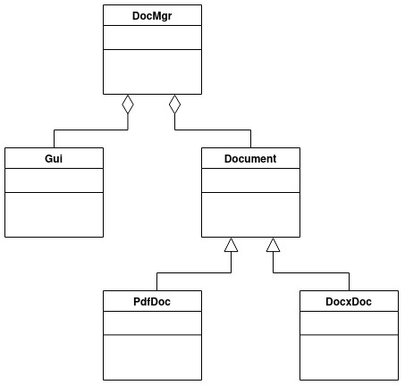
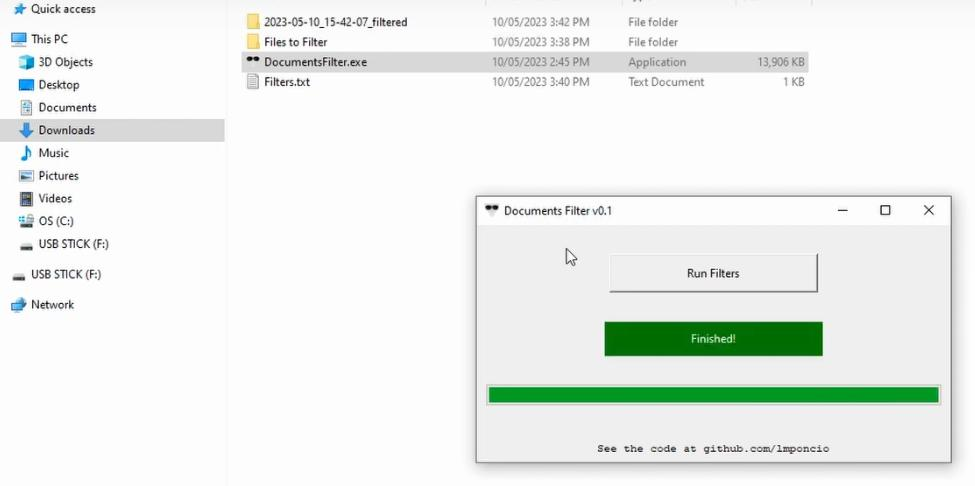

#   DocumentsFilter

Application for identifying documents containing specific strings.

## UML Class Diagram

The script has been written thinking of adding more Document subclasses in the future.

## GUI
Please see below an screenshot of the application user interface

## How to use it

### Using the executable file (easy way)

- Download "DocumentsFilter.zip" from [https://github.com/lmponcio/DocumentsFilter](https://github.com/lmponcio/DocumentsFilter/releases/tag/v0.1)
- Extract the "DocumentsFilter" folder into your computer (right click the zip file, and choose "Extract All")
- Open "Filters.txt", write one filter (or keyword) per line and save the file
- Copy all documents you want to analyse into "Files to Filter" folder (file extensions ".docx" and ".pdf")
- Double-click "DocumentsFilter.exe"
- Click "Run Filters"
- The results will be generated in a folder next to the exe file

### Using main.py (source code)

- Clone the repository into your computer
- In the same folder where main.py is located, create a "Files to Filter" directory and a "Filters.txt" file
- Open "Filters.txt", write one filter (or keyword) per line and save the file
- Copy all documents you want to analyse into "Files to Filter" folder (file extensions ".docx" and ".pdf")
- Create a python virtual environment and use requirements.txt to install all the required dependencies
- run main.py
- Click "Run Filters"
- The results will be generated in a folder next to the exe file
<!-- Here is video instructions as well
DocumentsFilter can be used for many different purposes. One purpose I thought could be useful for is filtering resumes. Please see below a video where the script is used for screening a big amount of resumes.

-->
## Important information
- DocumentsFilter checks [DOCX (**not DOC**)](https://www.howtogeek.com/304622/WHAT-IS-A-.DOCX-FILE-AND-HOW-IS-IT-DIFFERENT-FROM-A-.DOC-FILE-IN-MICROSOFT-WORD/) and PDF files. If files with other extensions are provided (DOC, JPEG, CSV, TXT, etc.) they will be ignored. This could change in future releases.
- The filters are not case-sensitive (if you write "Excel" or "excel" in Filters.txt it has the same effect). The script transforms both the filters and the documents content to lowercase, and checks if the  lower-cased filters are contained in the lower-cased documents content.
- DocumentsFilter is not 100% accurate - It's quite accurate, but not perfect. For more information check the libraries used for scanning the ".docx" files ([python-docx](https://github.com/python-openxml/python-docx)) and the ".pdf" files ([pypdf](https://github.com/py-pdf/pypdf)).
- Images are not checked, only text. In the future I might add optical character recognition so text in images is also checked, but for now it is only checking text elements.
- There is no AI involved. It is a script that goes through the text elements in documents and checks if the filter strings provided are present or absent. 

## Acknowledgments
DocumentsFilter is a Python code that uses external libraries to do its job. Special thanks to the mantainers of  [python-docx](https://github.com/python-openxml/python-docx), [pypdf](https://github.com/py-pdf/pypdf) and [openpyxl](https://foss.heptapod.net/openpyxl/openpyxl).

## Bibliography
- Logo created using [Canva](https://www.canva.com/)
- UML Class Diagram created using http://draw.io/
- Learned UML/OOP at [The Object-Oriented Thought Process by Matt Weisfeld](https://www.google.com.au/books/edition/The_Object_Oriented_Thought_Process/pxK0hSuDyX0C?hl=en&gbpv=1&dq=The+Object-Oriented+Thought+Process&printsec=frontcover)
- https://www.visual-paradigm.com/guide/uml-unified-modeling-language/uml-aggregation-vs-composition/
